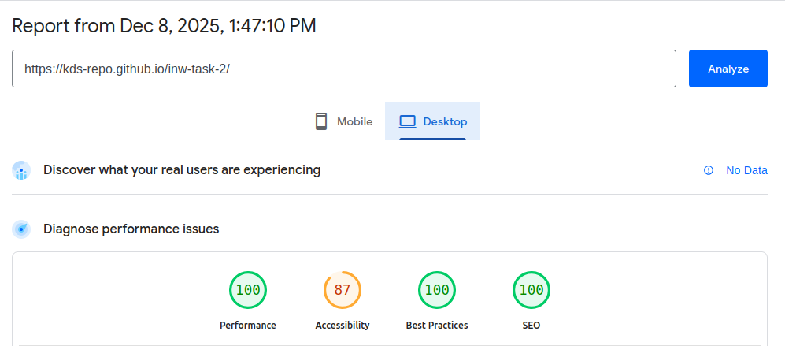
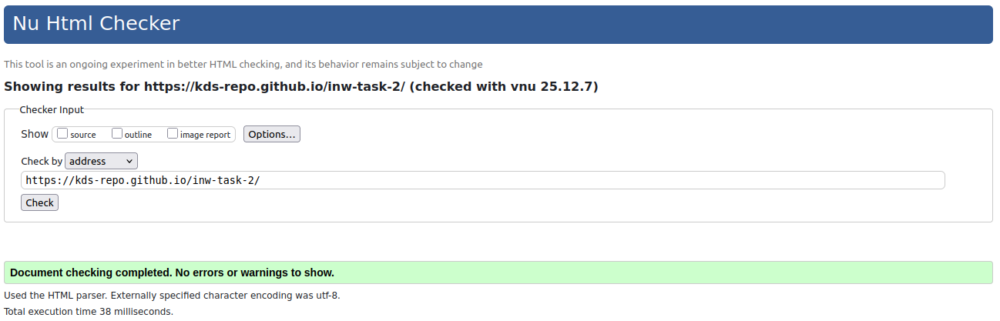

# Task

Innowise JS Internship: Task 2: HTML/CSS

Find the hosted solution at https://kds-repo.github.io/inw-task-2/

A Pixel Perfect copy of a FIGMA prototype (https://www.figma.com/design/FXH4IrR8Vho44BpcloBNfc/DEMO-for-Dima-Bukovsky?node-id=1-59862&t=KeC0DWIQs9XDffeJ-4). Implemented adaptive design for a range of display resolutions. Implemented a collapsing navigation menu for vertical screens.

#### PageSpeed check

#### W3C HTML check

# How to run the app

Option 1. Website\
Go to https://kds-repo.github.io/inw-task-2/ in your browser.

Option 2. VSCode local server\
Open the root folder of the project (it contains index.html and this README.md) as a VSCode workspace.\
Install Live Server extension for VSCode.\
Follow the instructions to start it using your workspace.\
It will start a simple server on port 5500. Go to "http://localhost:5500/".

Option 3. Local server\
Install a local server of your choice.\
Run it in the root folder of the project.\
Make sure that it registers index.html as the entry point of the site.

# Directory Structure

-/ - Root directory of the project. Contains index.html, which is the entry point to the site, and relevant js code

-fonts/ - Font styles

-img/ - Images for the site

-src/ - CSS style files organized in accordance with BEM Flexible file structure. A file ber block. Elements were placed in the same files as the blocks they belong to

-svg/ - SVG images
	